# Meterized LED Magic

Spread the light ☀️

## Overview
This is our meterized LED bar system. It is designed to be cheap, simple and modular. 

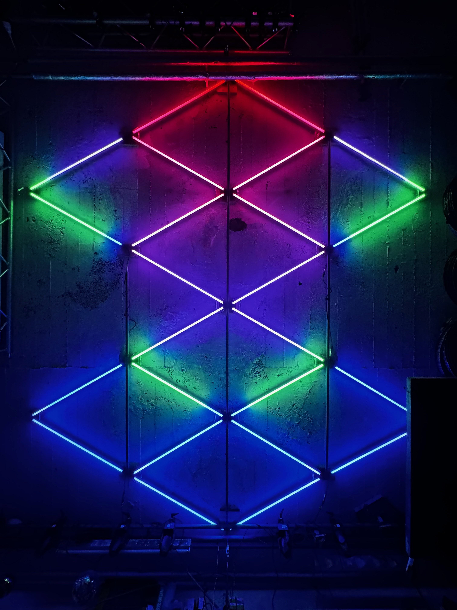
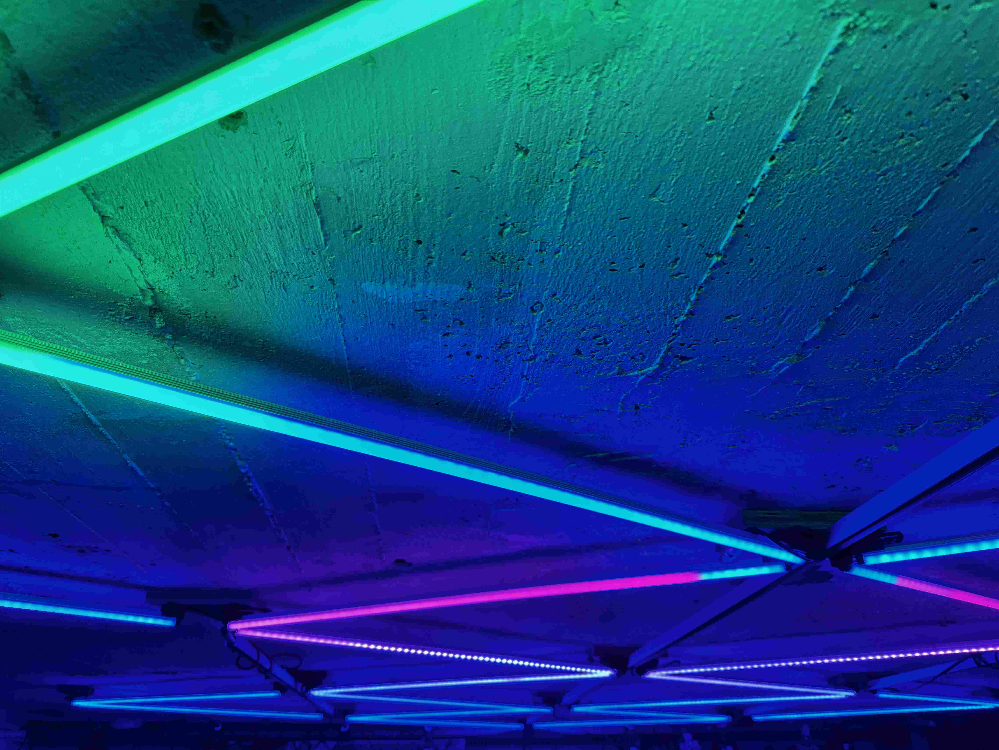
Note: Make sure to glue the LED strips properly - we used superglue. Else you can see the individual pixels as seen in the back of the image.s

## LED Bars

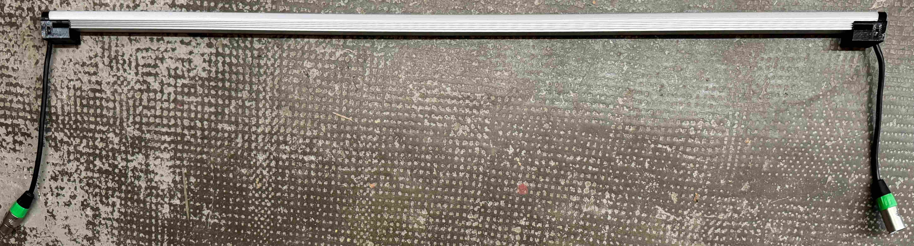

Simplicity is key. Each bar has 5 components. A aluminum bar, a diffuser, 3D printed end pieces, an LED strip and a short DMX cable on each side. This makes them relatively simple to build and maintain. At the same time, they are controller independent and modular. Bars can be connected in line with standard DMX cables for maximal flexibility.
Line length is limited by voltage drop and diminishing signal integrity over distance. 12 Strips in a line is a good limit for our setup. Results vary based on cable thickness and length.
In our configuration, each 1m LED Bar has 60 pixels.

## Power & Controls
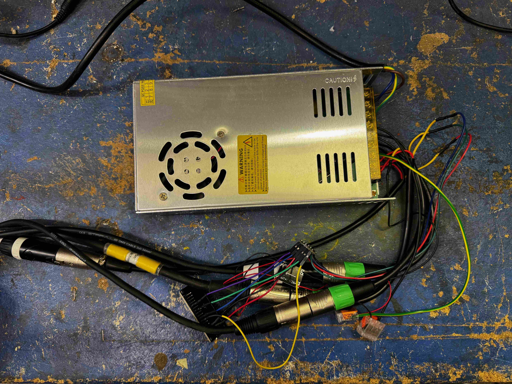    
### Power
We use a 12V 380W power supplies, as they allow us use the maximum amount of pixles our controller can handle at full brightness. Read more [here](https://kno.wled.ge/features/multi-strip/). 
For the set-up in the pictures above we use one power supply and controller each to control 4 lines of 4-8 LED bars.

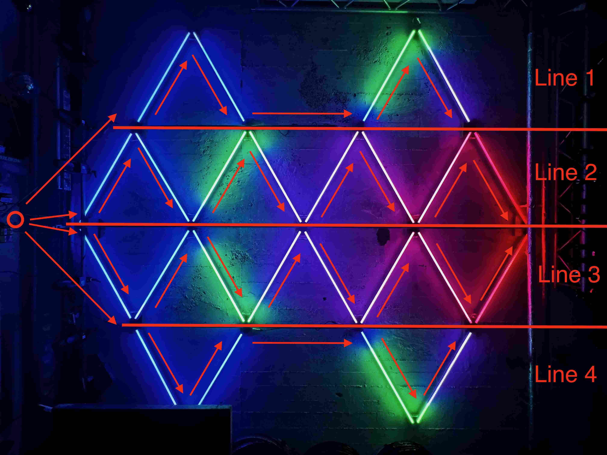    

### Controls
The LED Bars work with any method of controlling the underlying WS2815 LED strips. Our controller is based on a nodeMCU (WT32-ETH01), which utilized [WLED](https://kno.wled.ge) for generating Effects or translating [DMX/Art-Net](https://en.wikipedia.org/wiki/Art-Net) from other sources.
Our nodeMCU has an ethernet port for DMX/Art-Net and also supports wifi. Power is supplied through a DC-DC Converter (12 -> 5V). 
To increase reliability, signals are boosted using a logic level shifter, which ensures a 5V signal from the 3V signal source of the nodeMCU. [WLED Docs](https://kno.wled.ge/basics/getting-started/)
See here wiring diagram:

### Meownting
3D Model files and stl can be fund in /3d_models. It contains:

- Endcap
- Endcap Lid
- Mounting brace
- Mounting plate

Assembled, it works like this:

Have fun mounting 

## Requirements to build
- 3D Printer
- Laptop/PC to flash 

### Components
- [WS2815 LED Strips (we use 60LED/m)](https://de.aliexpress.com/item/32961181562.html)
- [Aluminium profiles with diffuser](https://www.amazon.de/gp/aw/d/B06XGBQC7X?psc=1&ref=ppx_pop_mob_b_asin_image)
- M4x12 screws and nuts
- [threaded inserts](https://de.aliexpress.com/item/1005005771957030.html)
- [DMX Male and Female connectors](https://de.aliexpress.com/item/1005005925090403.html)
- 3 pronged wire 6mm outer dimater
- glue 
  - to connect 3D printed parts to aluminum bars (we used epoxy)
  - to connect LED strips to aluminum bars (we used double sided gel tape)

## Manufacturing

### Strip assemply

1. Print 3D parts
2. put nuts & threaded inserts in printed end pieces
3. cut aluminum profiles and diffusers to desired length
4. Epoxy printed parts to aluminum profile
5. Wire up male & female DMX connectors to cables of preferred length
   1. make sure that male connector goes to the controller
6. Solder cables to LED Strips of correct length
   1. very short de-insulation required!
    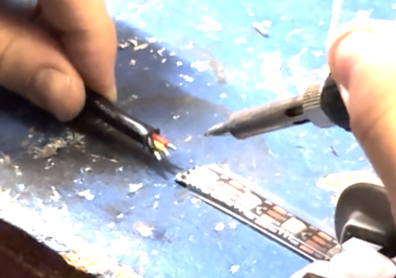
7. Glue LED Strips into aluminum profiles
8. screw 3D printed lid onto strip for wire strain relief
   1. 🚧 🚧 shit breaks here, be careful 🚧🚧
9.  Put diffuser on
10. test
11. celebrate 🎉

 Always wire up in Serial!

<table style="width:100%; border:0; margin:0; height: 300"><tr>
<td style="width:50%; border:0;">  </td>
<td style="width:50%; border:0;"> 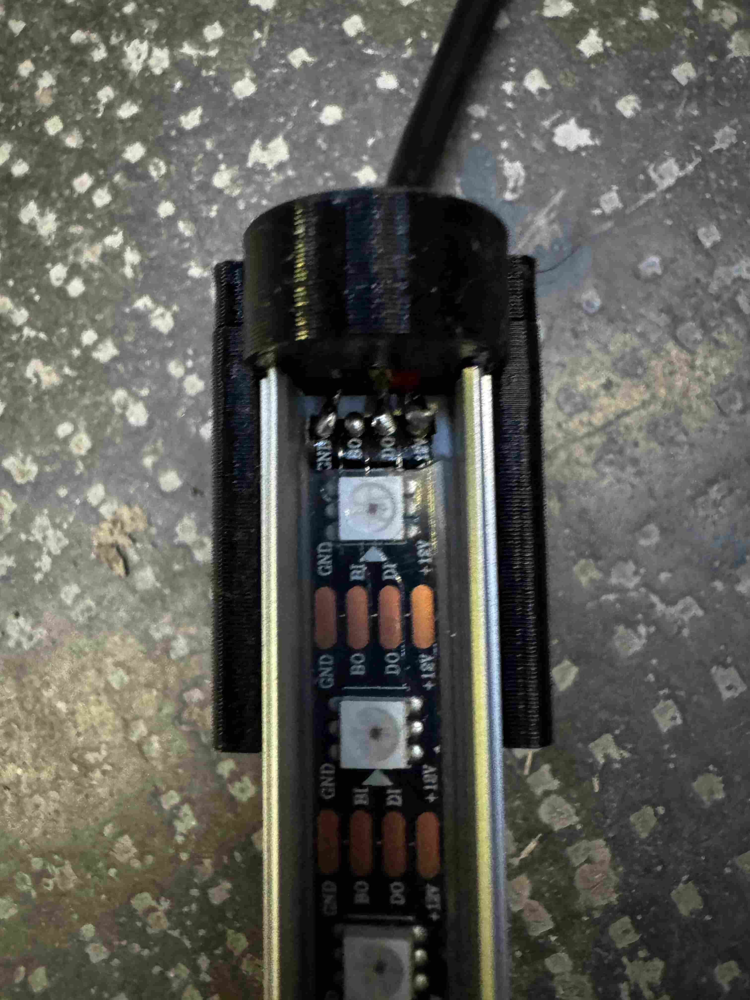 </td>
</tr></table>
Measuring and cutting precicely creates perfect seams!

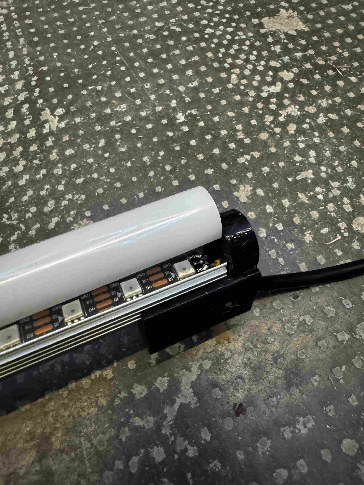

### Mounting

### Constroller Assembly

#### Flash Wled to nodeMCU
Basically do [what WLED needs](https://kno.wled.ge/basics/getting-started/)

<table style="width:100%; border:0; margin:0; height: 300"><tr>
<td style="width:33%; border:0;">   </td>
<td style="width:33%; border:0;"> 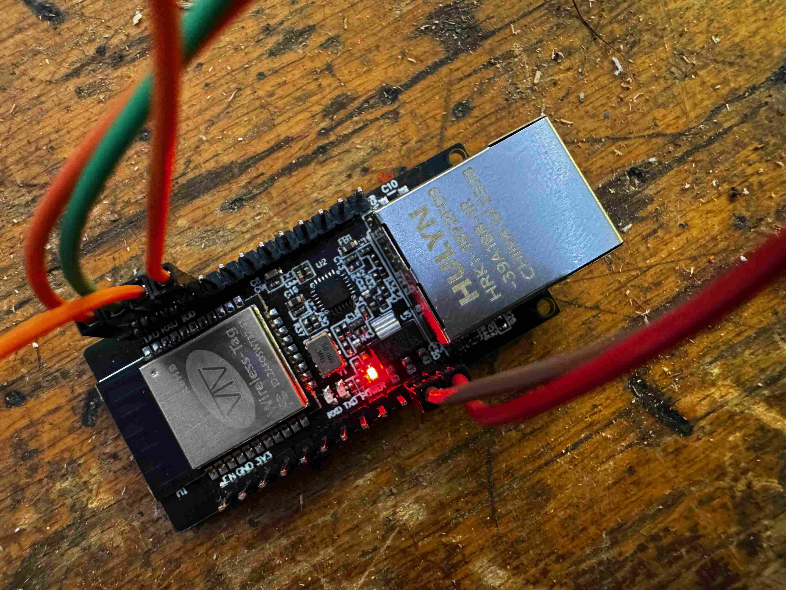  </td>
<td style="width:33%; border:0;"> 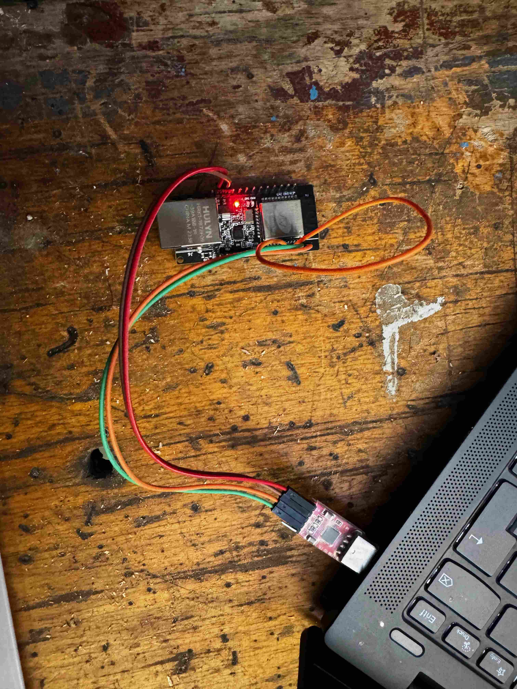 </td>
</tr>
</table>

#### Wire up Controller

Look at [WLED schematics](https://kno.wled.ge/basics/getting-started/) for reliable reference!

<table style="width:100%; border:0; margin:0; height: 300"><tr>
<td style="width:33%; border:0;">   </td>
<td style="width:33%; border:0;"> 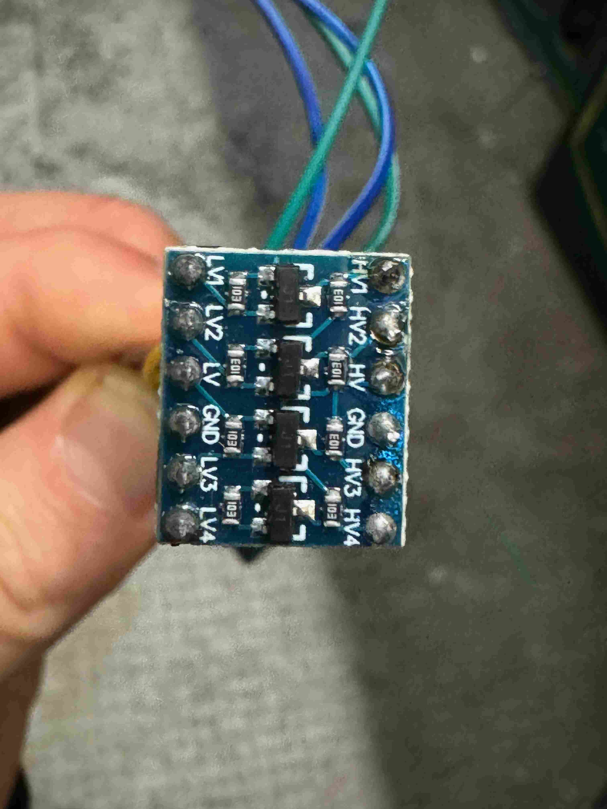  </td>
<td style="width:33%; border:0;"> 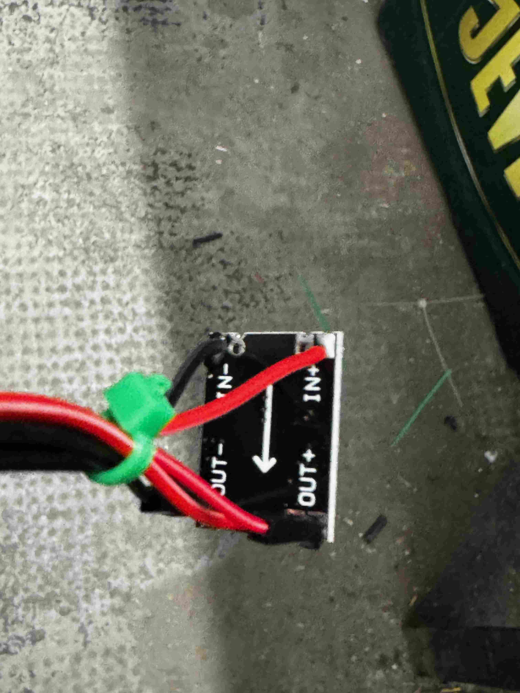 </td>
</tr>
</table>

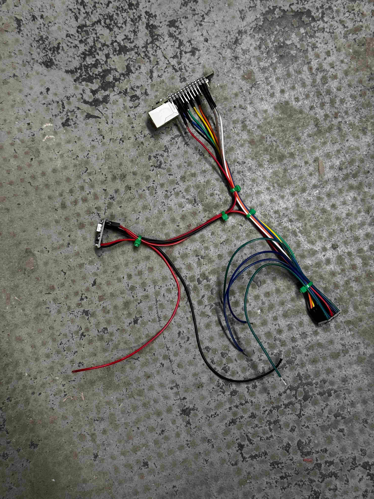
